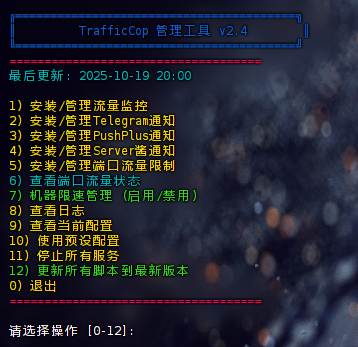

# TrafficCop - 智能流量监控与限制脚本
[English](README_EN.md) | 中文

[netjett](https://netjett.com/aff.php?aff=115)赞助了本项目

[](https://yxvm.com/aff.php?aff=718)

[NodeSupport](https://github.com/NodeSeekDev/NodeSupport)赞助了本项目

[VTEXS](https://console.vtexs.com/?affid=1554)赞助了本项目

[](https://dartnode.com?aff=SwiftPuppy719	 "Powered by DartNode - Free VPS for Open Source")

## 注意事项

1. 本脚本是基于vnstat的流量统计，vnstat只会在安装后开始统计流量!

2. TC模式无法防止DDoS消耗流量，流量消耗速度仍然较快！欢迎PR修复(如果可以修复的话)。

3. 如果遇到GitHub API速率限制问题,可以尝试以下解决方案:
   - 使用原始内容URL下载脚本
   - 等待API限制重置(通常1小时)
   - 使用个人访问令牌增加API限额
   - 手动下载脚本并运行

4. 脚本默认使用root权限运行。如需非root用户运行，请确保该用户有sudo权限，并将所有命令前加sudo。

5. 如果遇到问题，可以查看日志文件(/root/TrafficCop/traffic_monitor.log)获取更多信息。

6. 定期检查脚本更新以获取新功能和bug修复。

7. 对于特定VPS提供商，可能需要调整配置以适应其计费模式。

8. TC模式下的速度限制可能不是精确的，实际速度可能略有偏差。

9. 关机模式会完全切断网络连接，请谨慎使用。

10. 建议定期备份配置文件(traffic_monitor_config.txt)。

## 常见问题

Q: 为什么我的流量统计似乎不准确?
A: 确保vnstat已正确安装并运行一段时间。新安装的vnstat需要时间来收集准确的数据。

Q: 如何更改已设置的配置?
A: 重新运行脚本，它会提示你是否要修改现有配置。

Q: TC模式下SSH连接变慢怎么办?
A: 尝试增加TC模式下的速度限制值。

Q: 如何完全卸载脚本?
A: 使用以下命令:
```
sudo pkill -f traffic_monitor.sh
sudo rm -rf /root/TrafficCop
sudo tc qdisc del dev $(ip route | grep default | cut -d ' ' -f 5) root
```


## 一键安装脚本
### 一键安装交互式脚本
```
bash <(curl -sL https://raw.githubusercontent.com/ypq123456789/TrafficCop/main/trafficcop-manager.sh)
```
#### 功能

1. 安装流量监控 - 下载并安装基础的流量监控功能
2. 安装Telegram通知功能 - 添加Telegram推送通知
3. 安装PushPlus通知功能 - 添加PushPlus推送通知
4. 安装Server酱通知功能 - 添加Server酱推送通知
5. 安装端口流量限制 - 为多个端口设置独立的流量限制（支持多端口 2.0）
6. 查看端口流量状态 - 实时查看所有配置端口的流量使用情况（新增 2.0）
7. 机器限速管理 - 完整的机器级限速启用/禁用/恢复功能（新增 v2.4）
8. 查看日志 - 查看各种服务的日志文件
9. 查看当前配置 - 查看各种服务的配置文件
10. 使用预设配置 - 应用针对不同服务商优化的预设配置
11. 停止所有服务 - 停止所有TrafficCop相关服务
12. 更新所有脚本到最新版本 - 一键更新所有组件

#### 优势
1. 一站式管理 - 用户只需记住一个命令，即可管理所有TrafficCop功能
2. 交互式体验 - 通过数字菜单选择，无需记忆复杂命令
3. 可视化界面 - 使用彩色输出增强用户体验
4. 灵活操作 - 完成一项操作后返回主菜单，可继续选择其他操作
5. 用户友好 - 每个操作都有确认提示，避免误操作
   



### 一键全家桶TG推送（调用api，版本最新，可能会403）：
```
sudo apt update && mkdir -p /root/TrafficCop && curl -H "Accept: application/vnd.github.v3.raw" -fsSL "https://api.github.com/repos/ypq123456789/TrafficCop/contents/trafficcop.sh" | tr -d '\r' > /root/TrafficCop/traffic_monitor.sh && chmod +x /root/TrafficCop/traffic_monitor.sh && bash /root/TrafficCop/traffic_monitor.sh && sudo curl -H "Accept: application/vnd.github.v3.raw" -fsSL "https://api.github.com/repos/ypq123456789/TrafficCop/contents/tg_notifier.sh" | tr -d '\r' > /root/TrafficCop/tg_notifier.sh && chmod +x /root/TrafficCop/tg_notifier.sh && bash /root/TrafficCop/tg_notifier.sh
```
### 一键全家桶TG推送（从原始内容下载，版本可能落后）：
```
sudo apt update && mkdir -p /root/TrafficCop && curl -fsSL "https://raw.githubusercontent.com/ypq123456789/TrafficCop/main/trafficcop.sh" | tr -d '\r' > /root/TrafficCop/traffic_monitor.sh && chmod +x /root/TrafficCop/traffic_monitor.sh && bash /root/TrafficCop/traffic_monitor.sh && sudo curl -fsSL "https://raw.githubusercontent.com/ypq123456789/TrafficCop/main/tg_notifier.sh" | tr -d '\r' > /root/TrafficCop/tg_notifier.sh && chmod +x /root/TrafficCop/tg_notifier.sh && bash /root/TrafficCop/tg_notifier.sh
```
### 一键全家桶pushplus推送（调用api，版本最新，可能会403）：
```
sudo apt update && mkdir -p /root/TrafficCop && curl -H "Accept: application/vnd.github.v3.raw" -fsSL "https://api.github.com/repos/ypq123456789/TrafficCop/contents/trafficcop.sh" | tr -d '\r' > /root/TrafficCop/traffic_monitor.sh && chmod +x /root/TrafficCop/traffic_monitor.sh && bash /root/TrafficCop/traffic_monitor.sh && sudo curl -H "Accept: application/vnd.github.v3.raw" -fsSL "https://api.github.com/repos/ypq123456789/TrafficCop/contents/pushplus_notifier.sh" | tr -d '\r' > /root/TrafficCop/pushplus_notifier.sh && chmod +x /root/TrafficCop/pushplus_notifier.sh && bash /root/TrafficCop/pushplus_notifier.sh
```
### 一键全家桶pushplus推送（从原始内容下载，版本可能落后）：
```
sudo apt update && mkdir -p /root/TrafficCop && curl -fsSL "https://raw.githubusercontent.com/ypq123456789/TrafficCop/main/trafficcop.sh" | tr -d '\r' > /root/TrafficCop/traffic_monitor.sh && chmod +x /root/TrafficCop/traffic_monitor.sh && bash /root/TrafficCop/traffic_monitor.sh && sudo curl -fsSL "https://raw.githubusercontent.com/ypq123456789/TrafficCop/main/pushplus_notifier.sh" | tr -d '\r' > /root/TrafficCop/pushplus_notifier.sh && chmod +x /root/TrafficCop/pushplus_notifier.sh && bash /root/TrafficCop/pushplus_notifier.sh
```
### 我只要监控，不要推送：
```
sudo apt update &&  mkdir -p /root/TrafficCop && curl -H "Accept: application/vnd.github.v3.raw" -fsSL "https://api.github.com/repos/ypq123456789/TrafficCop/contents/trafficcop.sh" | tr -d '\r' > /root/TrafficCop/traffic_monitor.sh && chmod +x /root/TrafficCop/traffic_monitor.sh && bash /root/TrafficCop/traffic_monitor.sh
```
## 实用命令
### 查看日志：
```
sudo tail -f -n 30 /root/TrafficCop/traffic_monitor.log
```
### 查看当前配置：
```
sudo cat /root/TrafficCop/traffic_monitor_config.txt
```
### 紧急停止所有traffic_monitor进程（用于脚本出现问题时）：
```
sudo pkill -f traffic_monitor.sh
```
### 一键解除限速
```
sudo curl -sSL https://raw.githubusercontent.com/ypq123456789/TrafficCop/main/remove_traffic_limit.sh | sudo bash
```

## 脚本逻辑
- 自动检测并选择主要网卡进行流量限制。
- 用户选择流量统计模式（四种选项）。
- 用户设置流量计算周期（月/季/年）和起始日期。
- 用户输入流量限制和容错范围。
- 用户选择限制模式（TC模式或关机模式）。
- 对于TC模式，用户可设置限速值。
- 脚本每分钟检测流量消耗，达到限制时执行相应操作。
- 在新的流量周期开始时自动解除限制。

## 脚本特色
- 四种全面的流量统计模式，适应各种VPS计费方式。
- 自定义流量计算周期和起始日。
- 自定义流量容错范围。
- 交互式配置，可随时修改参数。
- 实时流量统计提示。
- TC模式保证SSH连接可用。
- 关机模式提供更严格的流量控制。
- 自定义限速带宽（TC模式）。

## Telegram Bot 集成
TrafficCop 现在集成了 Telegram Bot 功能，可以发送以下通知：

- 限速警告
- 限速解除通知
- 新周期开始通知
- 关机警告
- 每日流量报告

**支持自定义主机名，一个机器人就可以统一管理你的所有小鸡！**

**支持自定义每日流量报告的时间，你想每个小鸡什么时候通知就什么时候，当然你也可以设置都是一样的时间，一下子冒出来一堆，享受坐拥数🐔的快感**

要使用此功能，请在脚本配置过程中提供你的 Telegram Bot Token 和 Chat ID。

Telegram Bot Token 在你创建机器人时会显示。

Chat ID获取方法：https://api.telegram.org/bot${BOT_TOKEN}/getUpdates 

${BOT_TOKEN}是你的 Telegram Bot Token 

Chat ID还可以通过bot获取，更简单，比如[username_to_id_bot](https://t.me/username_to_id_bot)

### 相关命令
一键推送脚本（调用api，版本最新，可能会403）：
```
sudo apt update && mkdir -p /root/TrafficCop && curl -H "Accept: application/vnd.github.v3.raw" -fsSL "https://api.github.com/repos/ypq123456789/TrafficCop/contents/tg_notifier.sh" | tr -d '\r' > /root/TrafficCop/tg_notifier.sh && chmod +x /root/TrafficCop/tg_notifier.sh && bash /root/TrafficCop/tg_notifier.sh
```
一键推送脚本（从原始内容下载，版本可能落后）：
```
sudo apt update && mkdir -p /root/TrafficCop && curl -fsSL "https://raw.githubusercontent.com/ypq123456789/TrafficCop/main/tg_notifier.sh" | tr -d '\r' > /root/TrafficCop/tg_notifier.sh && chmod +x /root/TrafficCop/tg_notifier.sh && bash /root/TrafficCop/tg_notifier.sh
```
查看tg推送定时执行日志
```
sudo tail -f -n 30 /root/TrafficCop/tg_notifier_cron.log
```
查看当前状态
```
sudo tail -f -n 30 /root/TrafficCop/last_traffic_notification
```
杀死所有TG推送进程
```
sudo pkill -f tg_notifier.sh && crontab -l | grep -v "tg_notifier.sh" | crontab -
```

### 推送示意：

**机器总流量推送：**


**端口流量推送（新增）：**


端口流量推送展示了：
- 🔌 端口流量详情
- ✅ 实时使用量（精确到 0.01GB）
- 📊 流量限制对比
- 🎯 状态图标（✅绿色正常 / 🟡黄色警告 / 🔴红色超限）

## pushplus 集成
TrafficCop 现在集成了pushplus推送功能。

可发送的通知类型同上、支持自定义主机名、支持自定义每日流量报告的时间。

要使用此功能，请在脚本配置过程中提供你的pushplus token。

### 相关命令
一键推送脚本（调用api，版本最新，可能会403）：
```
sudo bash -c "mkdir -p /root/TrafficCop && curl -sSfL -H 'Accept: application/vnd.github.v3.raw' -o /root/TrafficCop/pushplus_notifier.sh https://api.github.com/repos/ypq123456789/TrafficCop/contents/pushplus_notifier.sh && chmod +x /root/TrafficCop/pushplus_notifier.sh && /root/TrafficCop/pushplus_notifier.sh"
```
一键推送脚本（从原始内容下载，版本可能落后）：
```
sudo mkdir -p /root/TrafficCop && curl -sSfL -o /root/TrafficCop/pushplus_notifier.sh https://raw.githubusercontent.com/ypq123456789/TrafficCop/main/pushplus_notifier.sh && chmod +x /root/TrafficCop/pushplus_notifier.sh && /root/TrafficCop/pushplus_notifier.sh
```
查看pushplus推送定时执行日志
```
sudo tail -f -n 30 /root/TrafficCop/pushplus_notifier_cron.log
```
查看当前状态
```
sudo tail -f -n 30 /root/TrafficCop/last_pushplus_notification
```
杀死所有pushplus推送进程
```
sudo pkill -f pushplus_notifier.sh && crontab -l | grep -v "pushplus_notifier.sh" | crontab -
```

推送示意如下：


## 端口流量限制功能 2.0（新增 - 支持多端口）

TrafficCop 现在支持为**多个端口**同时设置独立的流量限制！这个功能非常适合需要对特定服务（如Web服务器、代理服务、SSH等）进行精细化流量管理的场景。

### 功能特点

1. **多端口流量管理** - 同时监控和限制多个端口的流量，使用JSON格式存储配置
2. **独立端口流量统计** - 使用iptables精确统计每个端口的入站和出站流量
3. **实时流量查看** - 彩色可视化界面，显示所有端口的流量使用情况和进度条
4. **智能配置同步** - 自动同步机器配置，也支持自定义配置
5. **灵活的限制策略** - 支持两种限制模式：
   - TC模式：对端口流量进行限速
   - 阻断模式：超限后完全阻断端口流量
6. **配置验证** - 确保端口流量限制不超过机器总流量限制
7. **推送通知集成** - 所有推送服务（Telegram、PushPlus、ServerChan）自动包含端口流量信息
8. **自动化管理** - 支持定时任务自动监控和限制

### 使用逻辑

#### 场景一：机器未限制流量
当机器尚未配置流量限制时，为指定端口设置流量限制会：
1. 创建端口流量配置
2. 询问是否同步配置到机器流量限制
3. 如果选择同步，端口配置将自动应用到机器级别

#### 场景二：机器已限制流量
当机器已配置流量限制时，为指定端口设置流量限制会：
1. 检查端口流量限制是否小于等于机器流量限制
2. 默认继承机器的其他配置（统计模式、周期、限制模式等）
3. 允许自定义配置以满足特殊需求

### 安装和配置

#### 方法一：通过管理器脚本（推荐）
```bash
bash <(curl -sL https://raw.githubusercontent.com/ypq123456789/TrafficCop/main/trafficcop-manager.sh)
```
选择 "5) 安装端口流量限制"

#### 方法二：直接运行脚本
```bash
sudo mkdir -p /root/TrafficCop && \
curl -fsSL "https://raw.githubusercontent.com/ypq123456789/TrafficCop/main/port_traffic_limit.sh" | tr -d '\r' > /root/TrafficCop/port_traffic_limit.sh && \
chmod +x /root/TrafficCop/port_traffic_limit.sh && \
bash /root/TrafficCop/port_traffic_limit.sh
```

### 配置选项

在配置过程中，您需要提供：

1. **端口号** - 要限制流量的端口（1-65535）
2. **流量限制** - 端口允许使用的最大流量（GB）
3. **容错范围** - 触发限制前的缓冲区（GB）
4. **配置方式** - 选择使用机器配置或自定义配置

如果选择自定义配置，还需要设置：
- 流量统计模式（出站/入站/总计/最大值）
- 统计周期（月/季/年）
- 周期起始日
- 限制模式（TC限速/阻断）
- 限速值（仅TC模式）

### 相关命令

#### 查看所有端口流量（推荐）
```bash
# 普通查看
sudo bash /root/TrafficCop/view_port_traffic.sh

# 实时监控（每5秒刷新）
sudo bash /root/TrafficCop/view_port_traffic.sh --realtime

# 导出JSON报告
sudo bash /root/TrafficCop/view_port_traffic.sh --export
```

#### 管理端口配置
```bash
# 打开交互式配置菜单
sudo bash /root/TrafficCop/port_traffic_limit.sh

# 删除特定端口
sudo bash /root/TrafficCop/port_traffic_limit.sh --remove 80

# 删除所有端口配置
sudo bash /root/TrafficCop/port_traffic_limit.sh --remove
```

#### 通过管理器访问（推荐）
```bash
bash <(curl -sL https://raw.githubusercontent.com/ypq123456789/TrafficCop/main/trafficcop-manager.sh)
# 选择 12) 查看端口流量
# 选择 13) 管理端口配置
```

#### 查看配置文件
```bash
# 查看JSON配置（多端口）
sudo cat /root/TrafficCop/ports_traffic_config.json

# 美化输出
sudo cat /root/TrafficCop/ports_traffic_config.json | jq
```

### 使用示例

#### 场景：为多个服务配置独立流量限制

假设您的机器有1TB的总流量限制，您想为不同服务设置独立的流量配额：

**配置多个端口：**
1. 运行端口配置脚本
2. 添加端口80（Web服务）：200GB限制，10GB容错
3. 添加端口443（HTTPS）：300GB限制，15GB容错
4. 添加端口22（SSH）：50GB限制，5GB容错

**实时查看所有端口流量：**
```bash
sudo bash /root/TrafficCop/view_port_traffic.sh
```

输出示例：
```
════════════════════════════════════════════════════════════
        端口流量监控 - 2025-10-18 15:30:45
════════════════════════════════════════════════════════════

✅ 端口 80 (Web Server)
   已用: 150.2 GB / 200 GB (75.1%)
   [████████████████████████      ] 限速: 20kbit/s
   
🟡 端口 443 (HTTPS)
   已用: 280.5 GB / 300 GB (93.5%)
   [████████████████████████████  ] 限速: 50kbit/s
   
✅ 端口 22 (SSH)
   已用: 15.3 GB / 50 GB (30.6%)
   [█████████                     ] 限速: 10kbit/s

════════════════════════════════════════════════════════════
总计: 3个端口 | 总用量: 446.0 GB | 总限制: 550 GB
════════════════════════════════════════════════════════════
```

**推送通知示例（Telegram）：**
```
📊 [MyServer]每日流量报告

🖥️ 机器总流量：
当前使用：650.5 GB
流量限制：1000 GB

🔌 端口流量详情：
✅ 端口 80 (Web Server)：150.2GB / 200GB
🟡 端口 443 (HTTPS)：280.5GB / 300GB
✅ 端口 22 (SSH)：15.3GB / 50GB
```

当某个端口流量达到限制时：
- **TC模式**：端口速度将被限制到设定值（如20kbit/s）
- **阻断模式**：端口将被完全阻断，无法接收或发送数据
- **自动通知**：所有配置的推送服务会发送警告通知

### 技术原理

端口流量限制功能使用以下技术实现：

1. **iptables** - 创建规则统计特定端口的流量
2. **tc (Traffic Control)** - 实现端口级别的流量控制和限速
3. **HTB (Hierarchical Token Bucket)** - 分层流量控制，为不同端口分配不同的带宽
4. **Packet Marking** - 使用mangle表标记数据包，实现精确的流量分类

### 配置文件格式（JSON）

```json
{
  "ports": [
    {
      "port": 80,
      "description": "Web Server",
      "traffic_limit": 200,
      "traffic_tolerance": 10,
      "traffic_mode": "total",
      "traffic_period": "monthly",
      "period_start_day": 1,
      "limit_speed": 20,
      "main_interface": "eth0",
      "limit_mode": "tc",
      "created_at": "2025-10-18 12:00:00",
      "last_reset": "2025-10-01"
    }
  ]
}
```

### 注意事项

1. **依赖要求**：需要jq工具（脚本会自动安装）和iptables
2. **流量统计**：端口流量统计从配置时开始，不包含历史流量
3. **先决条件**：建议先运行主流量监控脚本，以确保依赖已安装
4. **性能影响**：TC模式可能对端口性能有轻微影响
5. **谨慎使用**：阻断模式会完全禁止端口通信，请谨慎使用
6. **多端口支持**：✅ 2.0版本已支持同时配置和管理多个端口
7. **推送集成**：端口流量信息已集成到所有推送通知中

## 预设配置
### 阿里云CDT 200G：
```
sudo curl -o /root/TrafficCop/traffic_monitor_config.txt https://raw.githubusercontent.com/ypq123456789/TrafficCop/main/ali-200g && cat /root/TrafficCop/traffic_monitor_config.txt
```
### 阿里云CDT 20G：
```
sudo curl -o /root/TrafficCop/traffic_monitor_config.txt https://raw.githubusercontent.com/ypq123456789/TrafficCop/main/ali-20g && cat /root/TrafficCop/traffic_monitor_config.txt
```
### 阿里云轻量 1T：
```
sudo curl -o /root/TrafficCop/traffic_monitor_config.txt https://raw.githubusercontent.com/ypq123456789/TrafficCop/main/ali-1T && cat /root/TrafficCop/traffic_monitor_config.txt
```
### azure学生 15G：
```
sudo curl -o /root/TrafficCop/traffic_monitor_config.txt https://raw.githubusercontent.com/ypq123456789/TrafficCop/main/az-15g && cat /root/TrafficCop/traffic_monitor_config.txt
```
### azure学生 115G：
```
sudo curl -o /root/TrafficCop/traffic_monitor_config.txt https://raw.githubusercontent.com/ypq123456789/TrafficCop/main/az-115g && cat /root/TrafficCop/traffic_monitor_config.txt
```

### GCP 625G[大流量极致解法](https://www.nodeseek.com/post-115166-1)：
```
sudo curl -o /root/TrafficCop/traffic_monitor_config.txt https://raw.githubusercontent.com/ypq123456789/TrafficCop/main/GCP-625g && cat /root/TrafficCop/traffic_monitor_config.txt
```
### GCP 200G(白嫖标准路由200g流量就跑)：
```
sudo curl -o /root/TrafficCop/traffic_monitor_config.txt https://raw.githubusercontent.com/ypq123456789/TrafficCop/main/GCP-200g && cat /root/TrafficCop/traffic_monitor_config.txt
```
### alice 1500G：
```
sudo curl -o /root/TrafficCop/traffic_monitor_config.txt https://raw.githubusercontent.com/ypq123456789/TrafficCop/main/alice-1500g && cat /root/TrafficCop/traffic_monitor_config.txt
```
### 亚洲云 300G：
```
sudo curl -o /root/TrafficCop/traffic_monitor_config.txt https://raw.githubusercontent.com/ypq123456789/TrafficCop/main/asia-300g && cat /root/TrafficCop/traffic_monitor_config.txt
```
## Star History

[](https://star-history.com/#ypq123456789/TrafficCop&Date)

## 交流TG群：
https://t.me/+ydvXl1_OBBBiZWM1

## 支持作者
<span><small>非常感谢您对本项目的兴趣！维护开源项目确实需要大量时间和精力投入。若您认为这个项目为您带来了价值，希望您能考虑给予一些支持，哪怕只是一杯咖啡的费用。
您的慷慨相助将激励我继续完善这个项目，使其更加实用。它还能让我更专心地参与开源社区的工作。如果您愿意提供赞助，可通过下列渠道：</small></span>
<ul>
    <li>给该项目点赞 &nbsp;<a style="vertical-align: text-bottom;" href="https://github.com/ypq123456789/TrafficCop">
      
    </a></li>
    <li>关注我的 Github &nbsp;<a style="vertical-align: text-bottom;"  href="https://github.com/ypq123456789/TrafficCop">
      
    </a></li>
</ul>
<table>
    <thead><tr>
        <th>微信</th>
        <th>支付宝</th>
    </tr></thead>
    <tbody><tr>
        <td></td>
        <td></td>
    </tr></tbody>
</table>